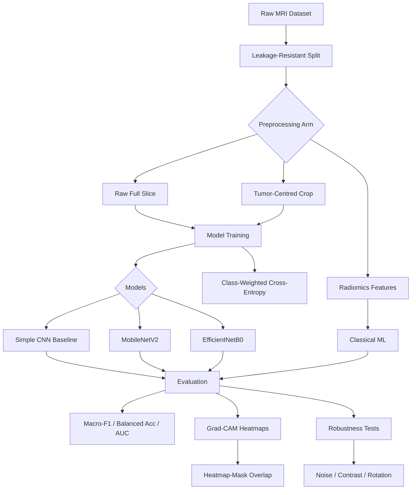

# Brain Tumor MRI Classification

Patient-independent, explainable, and computationally efficient **multiclass brain tumor MRI classification** system. This project classifies anonymised MRI slices into four categories: **glioma**, **meningioma**, **pituitary tumor**, and **no tumor**.

## Team & Contact

| Team Member | Email Address |
| :--- | :--- |
| **Vishesh Rao** | [vishesh.23csai@nst.rishihood.edu.in](mailto:vishesh.23csai@nst.rishihood.edu.in) |
| **Pranay Vishwakarma** | [pranay.v23csai@nst.rishihood.edu.in](mailto:pranay.v23csai@nst.rishihood.edu.in) |
| **Manu Vahan** | [manu.v23csai@nst.rishihood.edu.in](mailto:manu.v23csai@nst.rishihood.edu.in) |

🏢 **Institution:** Sajjan Agarwal School of Technology, [Rishihood University](https://rishihood.edu.in/)

📄 **Research Paper:** [Phase 1 Report (PDF)](docs/report/Brain_Tumor_MRI_Classification_Phase1_Report.pdf)

---

## Abstract

This report establishes the methodological foundation for a patient-independent, explainable, and computationally efficient multiclass brain tumor MRI classification system. The planned task is to classify anonymised MRI slices into four categories — glioma, meningioma, pituitary tumor, and no tumor — using publicly available datasets and models that are practical to train and deploy under limited computational resources.

We critically review ten core studies and one methodological paper across three themes: **transfer-learning performance**, **region-aware analysis and explainability**, and **evaluation reliability**. The review indicates that reported performance is strongly influenced by data-splitting procedures, class imbalance, and the limited validation of model explanations. In response, we define a leakage-resistant evaluation protocol, class-sensitive metrics, lightweight transfer-learning baselines, and a controlled comparison of image preprocessing and feature representations. **Grad-CAM** is used as a diagnostic explanation method and evaluated quantitatively when suitable tumor-region annotations are available.

The resulting framework prioritises a careful balance among predictive performance, computational cost, generalisation to unseen patients, and interpretability — providing a **reproducible and resource-conscious evaluation** rather than maximising complexity or benchmark accuracy alone.

**Index Terms:** Brain Tumor Classification, Magnetic Resonance Imaging, Convolutional Neural Networks, Transfer Learning, Explainable AI, Data Leakage, Patient-Independent Validation, Grad-CAM.

---

## Table of Contents

- [Motivation](#motivation)
- [Research Objectives](#research-objectives)
- [Problem Formulation](#problem-formulation)
- [Literature Review](#literature-review)
- [Dataset Characterisation](#dataset-characterisation)
- [Methodology & Pipeline](#methodology--pipeline)
- [Evaluation Protocol](#evaluation-protocol)
- [Project Structure](#project-structure)
- [Getting Started](#getting-started)
- [Literature-to-Design Decisions](#literature-to-design-decisions)
- [Phase Roadmap](#phase-roadmap)
- [References](#references)

---

## Motivation

Automated MRI-based diagnosis is one of the most heavily benchmarked problems in medical imaging, yet reported accuracies routinely exceed **98%** while clinical adoption remains limited. Three structural challenges distinguish this problem from a generic image-classification benchmark:

| Challenge | Description | Impact |
|-----------|-------------|--------|
| **Small, correlated datasets** | Public brain MRI datasets are small relative to natural-image corpora; multiple slices are drawn from the same patient | Standard random image-level splitting ignores patient correlation and inflates accuracy ([Yagis et al., 2021](https://doi.org/10.1038/s41598-021-90432-1)) |
| **Class imbalance** | Four tumor classes (glioma, meningioma, pituitary, no-tumor) are rarely balanced | Accuracy alone can mask poor minority-class recall |
| **Unvalidated explainability** | Grad-CAM is almost universally displayed but rarely validated against ground-truth tumor regions | High-accuracy models may not attend to clinically meaningful anatomy |

> **Central thesis:** The benchmark problem's greatest remaining challenge is not architectural but **evaluative** — genuine patient-level generalisation, honestly measured, rather than marginal accuracy gains from deeper networks.

---

## Research Objectives

### Primary Goals
1. Build a **patient-independent** four-class MRI classifier with lightweight, deployable architectures
2. Implement a **leakage-resistant evaluation protocol** with class-sensitive metrics
3. Compare **raw image vs. tumor-centred crop vs. radiomics** under identical evaluation
4. Generate and **quantitatively audit Grad-CAM** explanations where annotations exist
5. Test model **robustness** under mild perturbations without retraining

### Non-Goals (Phase 1)
- Maximising benchmark accuracy through complex ensemble or segmentation pipelines
- Claiming clinical validity without patient-level or external-dataset validation
- Treating Grad-CAM visualisations as proof of clinical correctness without quantitative overlap metrics

---

## Problem Formulation

Given an MRI slice \( x_i \in \mathbb{R}^{H \times W \times C} \) drawn from patient \( p_i \), predict a class label:

\[
y_i \in \{\text{glioma}, \text{meningioma}, \text{pituitary}, \text{no-tumor}\}
\]

Unlike a generic image-classification benchmark, samples are **not exchangeable**: multiple \( x_i \) share the same \( p_i \). Any evaluation split \( D = D_{\text{train}} \cup D_{\text{test}} \) must enforce:

\[
\{p_i : x_i \in D_{\text{train}}\} \cap \{p_i : x_i \in D_{\text{test}}\} = \emptyset
\]

### Primary Metrics

Because class frequencies are imbalanced, **plain accuracy is insufficient**. The project reports:

| Metric | Purpose |
|--------|---------|
| **Macro-F1** | Primary outcome — equal weight to all four classes |
| **Balanced accuracy** | Accounts for class frequency differences |
| **Per-class recall & specificity** | Detects minority-class failure modes |
| **One-vs-rest ROC-AUC** | Threshold-independent discrimination per class |
| **Accuracy** | Secondary, comparison-friendly figure only |

**Macro-F1** is computed as:

\[
F1_{\text{macro}} = \frac{1}{K} \sum_{k=1}^{K} \frac{2 \cdot \text{Prec}_k \cdot \text{Rec}_k}{\text{Prec}_k + \text{Rec}_k}, \quad K = 4
\]

Grad-CAM outputs are treated as a **diagnostic layer**, not part of the primary metric.

---

## Literature Review

Ten core papers and one essential methodological paper are reviewed across three thematic clusters. The review constructs a critical argument: the field's most consistent unaddressed flaw is the **conflation of in-dataset accuracy with genuine patient-level generalisation**.

### Cluster I — Transfer-Learning Benchmarks and the Accuracy Ceiling

| Paper | Key Contribution |
|-------|-----------------|
| Deepak & Ameer (2019) | Among the first to apply pretrained GoogLeNet with **patient-level 5-fold CV** — still uncommon in later work |
| Disci et al. (2025) | Systematic comparison of 6 pretrained CNNs on 7,023-image four-class dataset; **Xception** achieves strongest weighted accuracy/F1 |
| Vimala et al. (2023) | EfficientNetB0–B7 comparison with Grad-CAM; **EfficientNetB0** identified as strongest lightweight candidate |
| Ilani, Shi & Banad (2025) | **External cross-dataset validation** using U-Net, CNN, InceptionV3, EfficientNetB0, VGG16 |

**Synthesis:** Transfer learning reliably achieves >98% benchmark accuracy, but architecture choice alone is not a meaningful research contribution. Studies differ mainly in preprocessing, class balance, and splitting protocol. This justifies treating **MobileNetV2 / EfficientNetB0** as fixed lightweight baselines rather than the object of study.

### Cluster II — Localisation, Feature Fusion, and Interpretability

| Paper | Key Contribution |
|-------|-----------------|
| Aamir et al. (2025) | Enhancement + ROI extraction + attention + ensemble on BraTS2020/Figshare — high accuracy, high computational cost |
| Kathuria, Gupta & Uppal (2025) | Unified CNN for joint classification and segmentation |
| Iqbal et al. (2024) | **FusionNet** — deep spatial features + handcrafted radiomics; F1 = 96.12 ± 0.41 (binary task) |
| Jafari et al. (2025) | GLCM/Curvelet radiomics + classical ML (Random Forest, CatBoost) reach **95.2% without deep learning** |
| Musthafa et al. (2024) | ResNet50 + Grad-CAM for explainable detection |
| Iftikhar et al. (2025) | Compact custom CNN + Grad-CAM, SHAP, LIME; argues **smaller models generalise better** |

**Synthesis:** Segmentation/fusion methods report gains from explicit tumor-region information, yet radiomics-only approaches achieve comparable accuracy at far lower cost. The incremental value of full segmentation over a simple tumor-centred crop is rarely isolated experimentally. A controlled ablation (raw vs. crop vs. radiomics) is more resource-efficient than building a full segmentation-and-ensemble pipeline.

### Cluster III — Evaluation Rigour and Generalisation

| Paper | Key Contribution |
|-------|-----------------|
| **Yagis et al. (2021)** | Demonstrates slice-level splitting and pre-split augmentation can **severely inflate** reported performance — the single most load-bearing methodological reference |
| Ilani et al. (2025) | External cross-dataset testing as a stronger generalisation test than single-dataset protocols |

**Synthesis:** High in-dataset accuracy figures (Aamir, Disci, others) are not necessarily comparable because patient identifiers are frequently unused for splitting. Where identifiers are unavailable, image-level evaluation must be an **explicit, disclosed limitation**.

---

## Dataset Characterisation

### Primary Dataset

| Property | Detail |
|----------|--------|
| **Source** | 7,023-image four-class Brain Tumor MRI dataset ([Disci et al., 2025](https://doi.org/10.3390/cancers17010000)) |
| **Classes** | Glioma, meningioma, pituitary tumor, no tumor |
| **Modality** | T1-weighted and standard MRI slices |
| **Storage** | `data/raw/` (class-folder layout) |
| **Splits** | `data/splits/` (CSV/JSON manifests) |

### Structural Properties

**A. Absence of reliable patient identifiers**  
Several public collections do not expose patient-level IDs. Without subject IDs, image-level evaluation risks silently reporting inflated, leakage-contaminated accuracy. The project will:
- Explicitly document this limitation
- Split **before** augmentation
- Remove duplicate or near-duplicate images to reduce (though not eliminate) leakage risk

**B. Class imbalance across the four-class taxonomy**  
Consistent with Disci et al. and Rasa et al., per-class recall can be weak despite high overall accuracy. This motivates class-weighted loss and macro-averaged metrics as primary outcomes.

### Expected Directory Layout

```
data/raw/
├── glioma/
├── meningioma/
├── pituitary/
└── no_tumor/
```

> Do not commit large image files to git. See `.gitignore`.

---

## Methodology & Pipeline



### 1. Leakage-Resistant Splitting
- **Patient-level grouped splits** when subject IDs exist (Eq. 1)
- Where IDs unavailable: split before augmentation, remove near-duplicates
- **5-fold patient-level cross-validation** as baseline protocol ([Deepak & Ameer, 2019](https://doi.org/10.1016/j.bbe.2019.04.005))
- All splits, seeds, and parameters logged in `data/splits/`

### 2. Class-Balanced Lightweight Transfer Learning

| Model | Parameters | Role |
|-------|-----------|------|
| Simple 2–3 block CNN | ~1M | From-scratch baseline |
| **MobileNetV2** | ~3.4M | Lightweight transfer-learning baseline |
| **EfficientNetB0** | ~5.3M | Primary deployable model ([Vimala et al., 2023](https://doi.org/10.1038/s41598-023-34567-8)) |

- Pretrained on ImageNet, fine-tuned with **class-weighted cross-entropy**
- Input size: 224×224 (configurable in `configs/default.yaml`)
- Augmentation applied **only to training set, after split**

### 3. Tumor-Region Ablation

Three arms compared under **identical evaluation protocol**:

| Arm | Input | Model |
|-----|-------|-------|
| **A — Raw** | Full MRI slice, resized | CNN / MobileNetV2 / EfficientNetB0 |
| **B — Crop** | Tumour-centred crop (manual or heuristic ROI) | Same deep models |
| **C — Radiomics** | GLCM + Curvelet handcrafted features ([Jafari et al., 2025](https://doi.org/10.1002/hsr2.70000)) | Random Forest, CatBoost |

This isolates the marginal value of explicit localisation without committing to a full segmentation network.

### 4. Quantitatively Audited Explainability

- **Grad-CAM** generated for every trained model ([Musthafa et al., 2024](https://doi.org/10.1186/s12880-024-01234-5))
- Where segmentation masks or expert annotations exist: compute **heatmap–mask overlap** (IoU, pointing game accuracy)
- Optional **SHAP audit** for lightweight models ([Iftikhar et al., 2025](https://doi.org/10.1186/s40708-025-00234-6))
- Outputs saved to `outputs/gradcam/`

### 5. Robustness and Reproducibility

Held-out test images evaluated under mild perturbations **without retraining**:

| Perturbation | Default Setting |
|-------------|-----------------|
| Gaussian noise | σ = 0.05 |
| Contrast shift | ±20% |
| Small rotation | ±5° |

All hyperparameters, random seeds, and preprocessing steps are version-controlled via `configs/default.yaml`.

---

## Evaluation Protocol

```
┌─────────────────────────────────────────────────────────┐
│                  EVALUATION PROTOCOL                     │
├─────────────────────────────────────────────────────────┤
│  Split:     Patient-level grouped (or pre-aug image)    │
│  CV:        5-fold patient-level cross-validation       │
│  External:  Held-out test set when second dataset avail │
│  Primary:   Macro-F1, Balanced Accuracy                 │
│  Secondary: Accuracy, per-class Recall/Specificity      │
│  Ranking:   One-vs-rest ROC-AUC                         │
│  XAI:       Grad-CAM + heatmap-mask overlap (if masks)  │
│  Stress:    Noise / contrast / rotation (no retrain)    │
└─────────────────────────────────────────────────────────┘
```

### Methodological Requirements

| Requirement | Rationale | Source |
|-------------|-----------|--------|
| No random image-level k-fold | Prevents correlated slices in train & test | Yagis et al. [11] |
| Macro-F1 over accuracy | Insensitive to class imbalance | Disci [3], Rasa [10] |
| Grad-CAM overlap metrics | Validates explanation, not just displays it | Musthafa [6], Iftikhar [13] |
| External test set | Stronger generalisation evidence | Ilani [2] |
| Lightweight backbones | Practical deployability under resource limits | Vimala [7], Iftikhar [13] |

---

## Project Structure

```
ComputerVision_Prj/
├── README.md
├── requirements.txt
├── configs/
│   └── default.yaml              # Hyperparameters, paths, split settings
├── data/
│   ├── raw/                      # Original MRI images (not tracked in git)
│   │   ├── glioma/
│   │   ├── meningioma/
│   │   ├── pituitary/
│   │   └── no_tumor/
│   ├── processed/                # Preprocessed / cropped images
│   └── splits/                   # Train/val/test CSV or JSON manifests
├── docs/
│   └── report/
│       └── Brain_Tumor_MRI_Classification_Phase1_Report.pdf
├── notebooks/
│   └── eda.ipynb                 # Exploratory data analysis
├── scripts/
│   ├── prepare_data.py           # Download, deduplicate, create splits
│   ├── train.py                  # Train a model from config
│   └── evaluate.py               # Metrics, robustness, Grad-CAM eval
├── src/
│   ├── data/
│   │   ├── dataset.py            # PyTorch Dataset / DataLoader
│   │   ├── transforms.py         # Augmentation (applied post-split)
│   │   └── splitting.py          # Patient-level & leakage-resistant splits
│   ├── models/
│   │   ├── baseline_cnn.py       # Simple from-scratch CNN
│   │   ├── transfer_learning.py  # MobileNetV2, EfficientNetB0
│   │   └── radiomics_baseline.py # Handcrafted features + classical ML
│   ├── training/
│   │   ├── trainer.py            # Training loop
│   │   └── metrics.py            # Macro-F1, balanced accuracy, AUC
│   ├── explainability/
│   │   └── gradcam.py            # Grad-CAM generation & overlap metrics
│   └── evaluation/
│       └── robustness.py         # Noise, contrast, rotation stress tests
├── outputs/
│   ├── models/                   # Saved checkpoints
│   ├── figures/                  # Plots and confusion matrices
│   └── gradcam/                  # Explanation heatmaps
└── tests/
    └── test_splitting.py         # Unit tests for split logic
```

---

## Getting Started

### Prerequisites
- Python 3.10+
- CUDA-capable GPU recommended (lightweight models also run on CPU)
- ~2 GB disk space for dataset

### Installation

```bash
git clone <repository-url>
cd ComputerVision_Prj
python -m venv .venv
source .venv/bin/activate        # Windows: .venv\Scripts\activate
pip install -r requirements.txt
```

### Data Preparation

1. Download the [Brain Tumor MRI dataset](https://www.kaggle.com/datasets/sartajbhuvaji/brain-tumor-classification-mri) (or equivalent 7,023-image four-class collection)
2. Organise into class subfolders under `data/raw/`
3. Run the preparation script:

```bash
python scripts/prepare_data.py --config configs/default.yaml
```

### Training

```bash
# Primary deployable model
python scripts/train.py --config configs/default.yaml --model efficientnet_b0

# Lightweight baseline
python scripts/train.py --config configs/default.yaml --model mobilenet_v2

# From-scratch CNN baseline
python scripts/train.py --config configs/default.yaml --model simple_cnn

# Radiomics + classical ML arm
python scripts/train.py --config configs/default.yaml --model radiomics
```

### Evaluation

```bash
# Full evaluation: metrics + Grad-CAM + robustness
python scripts/evaluate.py --config configs/default.yaml --checkpoint outputs/models/best.pt

# Robustness stress tests only
python scripts/evaluate.py --config configs/default.yaml --checkpoint outputs/models/best.pt --robustness-only
```

---

## Literature-to-Design Decisions

Every Phase 1 design decision is derived from a specific finding in the reviewed literature:

| Paper | Key Finding | Phase 1 Decision |
|-------|-------------|-----------------|
| Yagis [11] | Slice-level leakage inflates accuracy | Patient-level grouped split |
| Deepak [9] | Patient-level CV is the correct benchmark | Baseline 5-fold patient-level CV |
| Disci [3] | Transfer-learning ceiling; Xception best overall | MobileNetV2 / EfficientNetB0 as fixed baselines |
| Ilani [2] | External validation improves robustness | Held-out external test set |
| Aamir [1] | ROI + attention boosts accuracy | Tumor-crop ablation arm |
| Iqbal [14] | Feature fusion competitive with deep nets | Hybrid radiomics-CNN ablation |
| Jafari [15] | Radiomics + classical ML competitive | Radiomics baseline arm |
| Musthafa [6] | Grad-CAM shows attention regions | Heatmap generation protocol |
| Iftikhar [13] | Smaller models deploy better; multi-XAI | Lightweight backbone; SHAP audit |
| Vimala [7] | EfficientNetB0 strongest lightweight net | Primary deployable model |

---

## Phase Roadmap

| Phase | Scope | Status |
|-------|-------|--------|
| **Phase 1** | Literature review, methodology design, evaluation protocol, lightweight baselines | ✅ Complete (see [report PDF](docs/report/Brain_Tumor_MRI_Classification_Phase1_Report.pdf)) |
| **Phase 2** | Data pipeline implementation, patient-level splits, baseline training | 🔲 Planned |
| **Phase 3** | Tumor-crop & radiomics ablation experiments | 🔲 Planned |
| **Phase 4** | Grad-CAM quantitative audit, robustness testing | 🔲 Planned |
| **Phase 5** | External dataset validation, final report & deployment | 🔲 Planned |

---

## References

Full bibliography from the Phase 1 research report:

1. Aamir et al., "An automated deep learning framework for brain tumor classification using MRI imagery," *Sci. Rep.*, 2025.
2. E. Ilani, X. Shi, and A. Banad, "T1-weighted MRI-based brain tumor classification using hybrid deep learning models," *Sci. Rep.*, 2025.
3. M. Disci, M. Gurcan, and A. Soylu, "Advanced brain tumor classification in MR images using transfer learning and pre-trained deep CNN models," *Cancers*, vol. 17, 2025.
4. R. Kathuria, S. Gupta, and R. Uppal, "Convolutional neural network-based framework for brain tumor classification and segmentation using magnetic resonance images," *J. Vis. Exp.*, 2025.
5. "Improving brain tumor multiclass classification with semantic features," *IEEE Conf. Publ.*, 2024.
6. N. A. Musthafa et al., "Enhancing brain tumor detection in MRI images through explainable AI using Grad-CAM with ResNet50," *BMC Med. Imaging*, 2024.
7. K. Vimala et al., "Detection and classification of brain tumor using hybrid deep learning models," *Sci. Rep.*, 2023.
8. A. Kumar et al., "IBRDM: An intelligent framework for brain tumor classification using radiomics- and DWT-based fusion of MRI sequences," *ACM Trans. Internet Technol.*, 2024.
9. S. Deepak and P. M. Ameer, "Brain tumor classification using deep CNN features via transfer learning," *Biocybern. Biomed. Eng.*, 2019.
10. Rasa et al., "Brain tumor classification using fine-tuned transfer learning models on MRI images," *Digit. Health*, 2024.
11. K. Yagis et al., "Effect of data leakage in brain MRI classification using 2D convolutional neural networks," *Sci. Rep.*, 2021.
12. Chelghoum et al., "Transfer learning using convolutional neural network architectures for brain tumor classification from MRI images," 2020.
13. Iftikhar et al., "Explainable CNN for brain tumor detection and classification through XAI based key features identification," *Brain Inform.*, 2025.
14. Iqbal et al., "Hybrid deep spatial and statistical feature fusion for accurate MRI brain tumor classification," *Front. Comput. Neurosci.*, 2024.
15. Jafari et al., "Hybrid radiomics and machine learning for brain tumors multi-task classification: an exploratory study on integrating GLCM and Curvelet-based features for enhanced accuracy," *Health Sci. Rep.*, 2025.

---

## License

Academic / research use. Add a license file before public release.

---

## Acknowledgements

This work is conducted as part of the Computer Vision course at Rishihood University (NST). The methodological foundation draws on the critical literature review documented in the [Phase 1 report](docs/report/Brain_Tumor_MRI_Classification_Phase1_Report.pdf).
